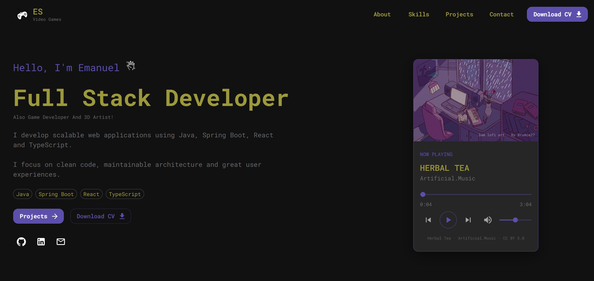

# Emanuel Sceppaquercia · Personal Portfolio

<p align="center">
  
</p>

Personal portfolio developed as a web application to showcase my projects, technical skills, and professional experience.

**🌐 Live website:** [Click here](https://r-emanuel-sceppaquercia.github.io/portfolio/)

## Tech Stack

### Frontend

- React 19
- TypeScript
- Vite
- Material UI
- Prettier
- ESLint

### Backend _(planned)_

- Java
- Spring Boot
- Spring Security
- PostgreSQL

## Project Structure

```text
Portfolio/
├── docs/
│   └── preview.png
├── Modules/
│   ├── Frontend/
│   └── Backend/ (planned)
└── README.md
```

## Features

- Responsive design
- Dark themed UI
- Smooth section navigation
- Interactive music player
- Animated UI elements
- Downloadable CV
- Project showcase

## Credits

### Music

- **Nighttime Stroll** — Artificial.Music  
  https://breakingcopyright.com/es/song/artificialmusic-nighttime-stroll

- **Herbal Tea** — Artificial.Music  
  https://breakingcopyright.com/es/song/artificialmusic-herbal-tea

- **Almost There** — Artificial.Music  
  https://breakingcopyright.com/es/song/artificialmusic-almost-there

Licensed under **CC BY 3.0**.

### Artwork

- **3am lofi art** — BroAce27  
  https://www.deviantart.com/broace27/art/3am-lofi-art-GIF-846732723

Licensed under **CC BY 3.0**.

## License

This project is licensed under the MIT License.

Third-party music and artwork remain the property of their respective creators
and are used under their corresponding Creative Commons licenses.
